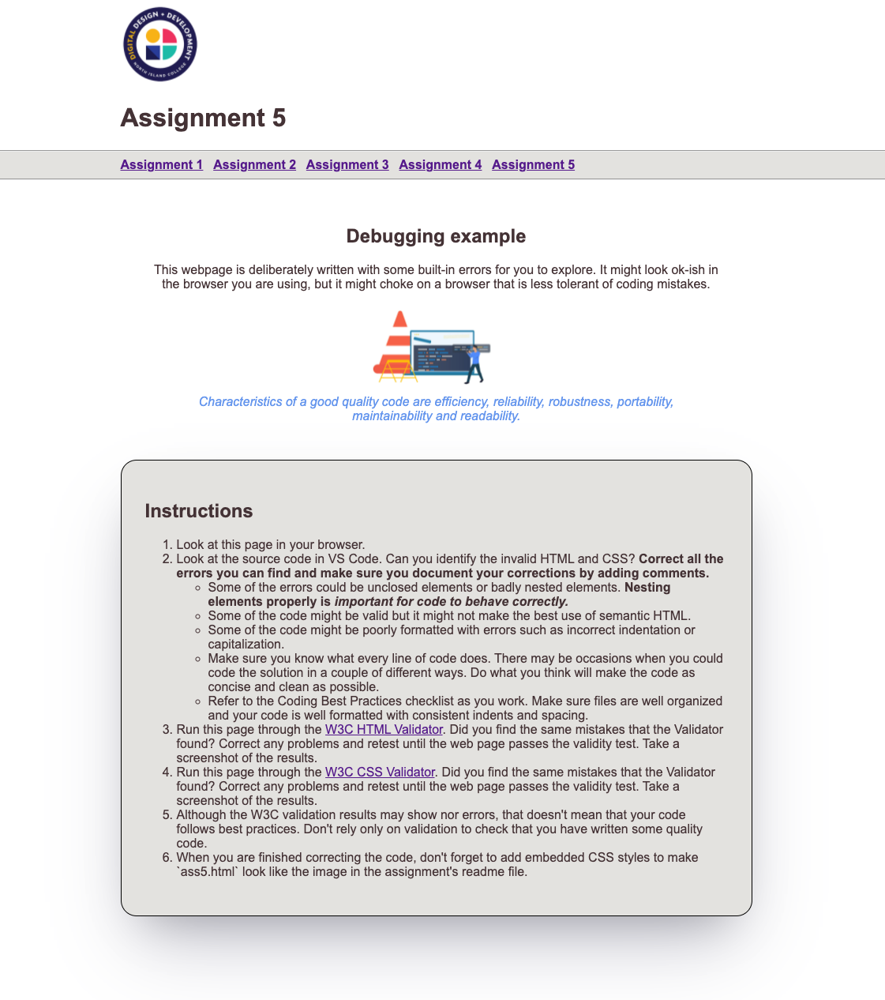

# Assignment 5 - Coding Best Practices

This is your remote assignment 5 repository readme file. You are seeing this file because you have successfully accepted the assignment link and GitHub automatically created a remote repository for you. Now you can complete the assignment steps below.

## Objectives

You will use the work you created for assignment 4 and add the provided HTML page to it, you will then correct the errors in the provided HTML and CSS and use the CSS box model to improve the layout of the page. The goal of this assignment is to practice debugging invalid code, applying formatting best practices and using the CSS box model properties. 

## Requirements

Here's a list of the things that I'd like you to include in this week's assignment:

1. Copy all the files from assignment 4 into your assignment 5 local repo.
2. Include a link to `ass5.html` called "Assignment 5" in the navigation bar on all the pages in your repo. 
3. Follow the instructions in the provided `ass5.html` to correct all the HTML errors that you can find. Make sure you document what you corrected and why you corrected it by adding comments to the file.
4. Add CSS styles to make `ass5.html` look like the image below. Your styles can be embbedded or external but they should only affect ass5.html. You should be able to accomplish the layout in the image using only a few lines of CSS, none of the HTML should need editing: 

Tips: 
Tips are included in the ass5.html content. make sure you read it!

## Assignment Steps

1. Clone your remote GitHub repository onto your local machine.
2. Open your local repository in VS Code.
3. Complete the assignment requirements listed above.
4. Commit the in-progress web page to the local repository regularly. Push your commits to GitHub any time you’ve made significant progress. You can push your work to GitHub as many times as you like before the assignment deadline.
5. When you are finished, make sure you have added comments as appropriate and validated your work (both HTML and CSS).
6. Submit your assignment in BBL:
   - Click on the assignment title under Weekly Assignments then click on the "Write Submission" button.
   - In the text field:
     - Type your assignment URL (for ex: `https://github.com/DGL103-Fall2021-CVS1-DLU1/assignment5-AskClaireGuiot`)
     - Answer the following questions: How much time did you spend on this assignment? Was it easy, moderate, difficult? Are there any specific topics that you still find confusing?
     - Attach the screenshots of your final W3C validation HTML and CSS results.
   - Click "Submit" to let me know that you have completed the assignment and I can grade your work.

## Note

You will include the work you produce for this assignment in your next assignment.

## Grading

I will be grading this assignment based on the rubric which you can access my clicking on the assignment title in BBL. Make sure you read the rubric carefully so you understand how your work will be assessed.